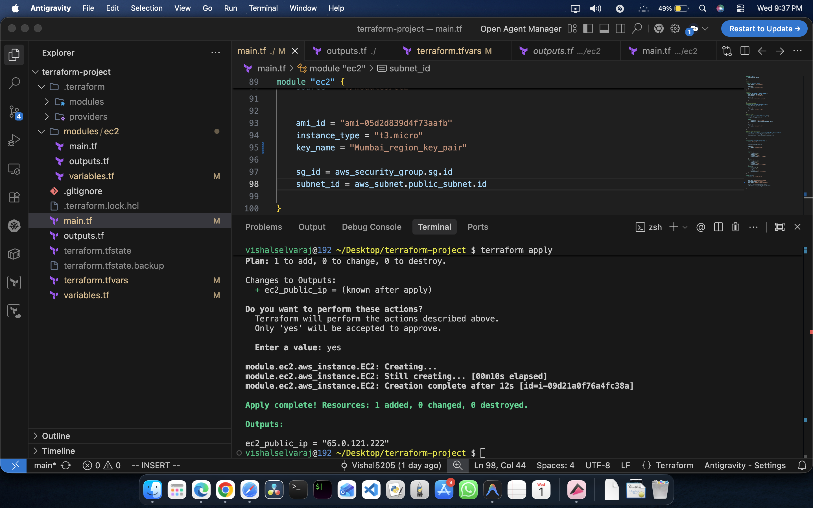
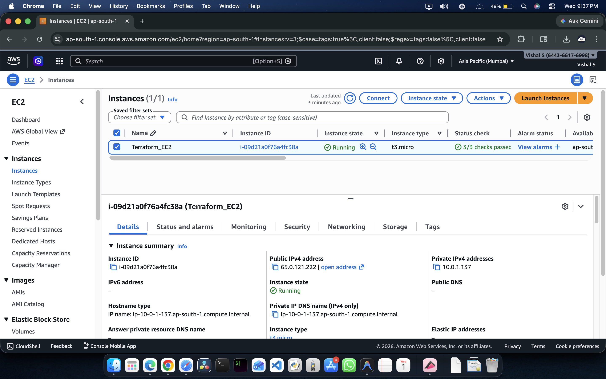
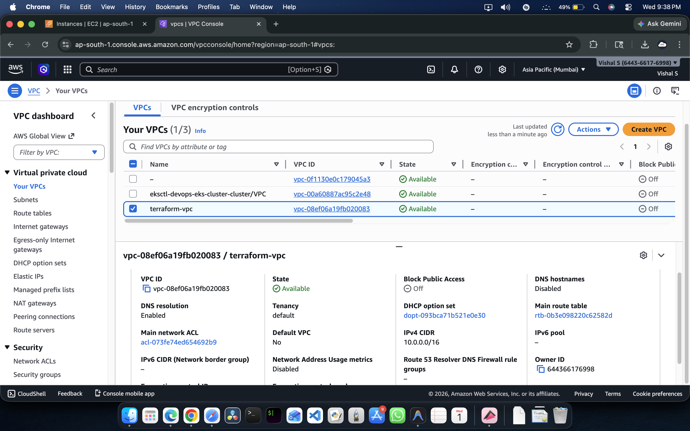
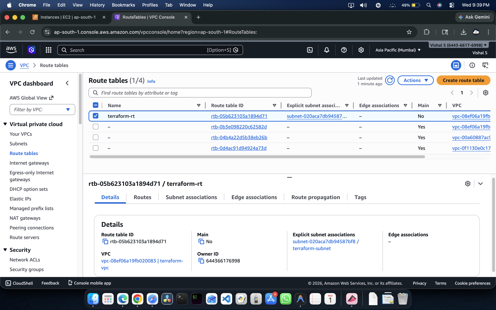
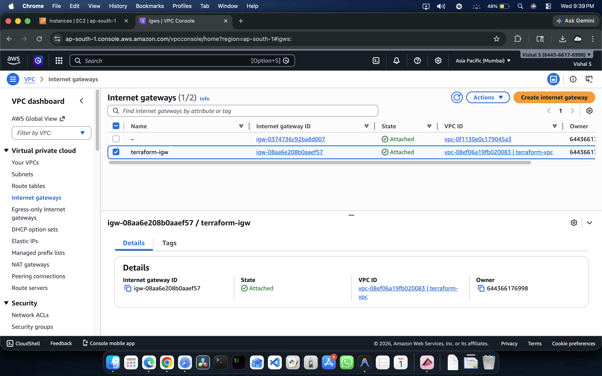
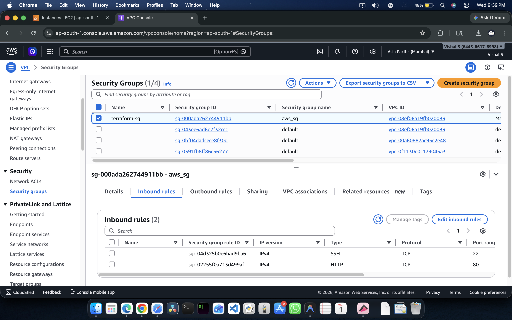
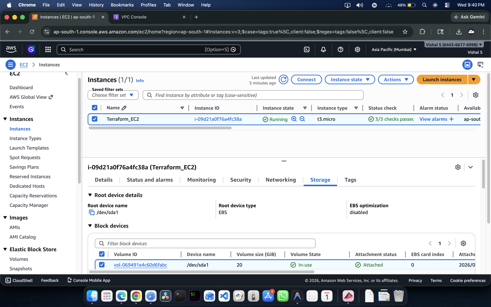
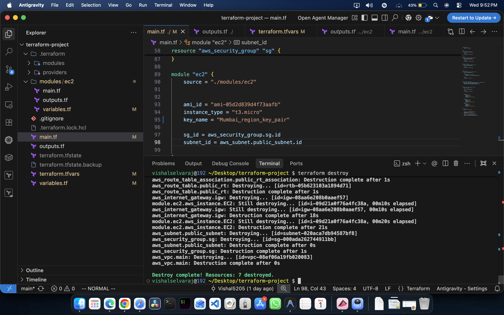

#  Terraform AWS Infrastructure Project

##  Overview

This project demonstrates how to provision a complete AWS infrastructure using **Terraform**.

The infrastructure includes:

* Custom VPC
* Public Subnet
* Internet Gateway
* Route Table
* Security Group
* EC2 Instance
* EBS Volume

---

##  Architecture (High-Level)

The infrastructure follows this flow:

Internet → Internet Gateway → Route Table → Public Subnet → EC2 Instance

---

##  Technologies Used

* Terraform
* AWS (EC2, VPC, IAM, EBS)
* Git & GitHub

---

##  Project Structure

```
terraform-project/
│
├── main.tf
├── variables.tf
├── outputs.tf
├── terraform.tfvars
│
├── modules/
│   └── ec2/
│       ├── main.tf
│       ├── variables.tf
│       └── outputs.tf
│
└── screenshots/
```

---

##  Infrastructure Details

###  VPC

* CIDR Block: `10.0.0.0/16`

###  Public Subnet

* CIDR Block: `10.0.1.0/24`

###  Internet Gateway

* Enables internet access for resources

###  Route Table

* Route: `0.0.0.0/0 → Internet Gateway`

###  Security Group

* SSH (22) → Open
* HTTP (80) → Open

###  EC2 Instance

* Instance Type: `t3.micro`
* Public IP: Enabled

### 💾 EBS Volume

* Size: 20GB
* Type: gp3

---

##  How to Deploy

### 1. Initialize Terraform

```
terraform init
```

### 2. Validate Configuration

```
terraform validate
```

### 3. Plan Infrastructure

```
terraform plan
```

### 4. Apply Infrastructure

```
terraform apply
```

---

##  Destroy Infrastructure

To avoid AWS charges:

```
terraform destroy
```

---

##  Screenshots

### Terraform Apply



### EC2 Instance Running



### VPC



### Route Table



### Internet Gateway



### Security Group



### EBS Volume



### Terraform Destroy



---

## 💡 Key Learnings

* Infrastructure as Code using Terraform
* AWS Networking (VPC, Subnet, IGW, Route Tables)
* EC2 provisioning with security groups
* Modular Terraform structure

---

* GitHub: https://github.com/Vishal5205
* LinkedIn: vishal-s-devops
* Email: [svishal1326@gmail.com](mailto:svishal1326@gmail.com)

---
